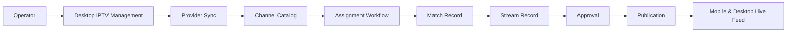
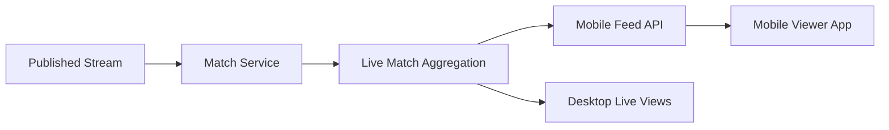
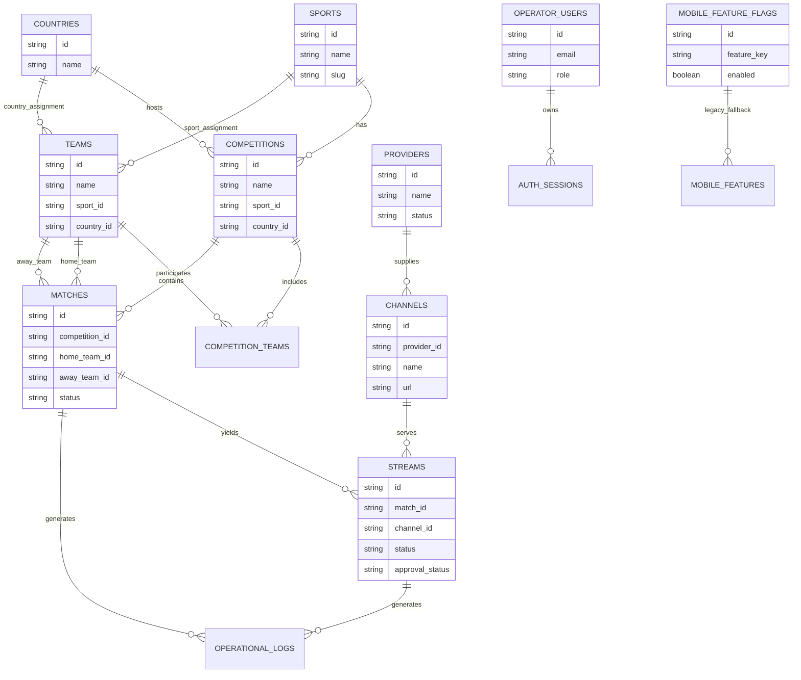
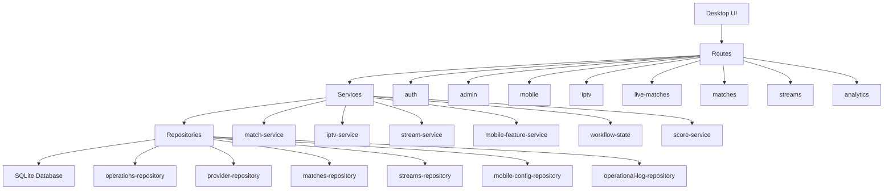

# GiTO Live Sports Product Specification v2.0

## Status
- Version: 2.0
- Status: Canonical product and architecture specification
- Owner: Product, Platform, and Operations
- Scope: Desktop operator console, backend services, mobile viewer app, shared contracts, data model, workflows, and integrations
- Note: This document supersedes prior audit notes and becomes the single source of truth for all future development.

---

## 1. Product purpose and strategic intent

GiTO Live Sports is a live sports operations platform that combines catalog management, IPTV ingestion, match assignment, stream approval/publishing, and viewer delivery. The product must provide:

- reliable ingestion of sports media sources and channels
- safe operator control over match-to-stream assignment and publication
- a fast, reliable mobile viewing experience for end users
- a unified operations view for support, approvals, and analytics
- a stable data model that supports long-term growth without architectural drift

The product currently has working workflows but carries architectural debt from parallel domain models, legacy fallback logic, and overlapping APIs. The target state is a simplified, capability-driven architecture that makes every feature traceable to a business outcome.

---

## 2. Product principles

1. Every feature must map to a business capability.
2. One canonical model must exist for each domain.
3. Live and operational data must be preserved even when catalog metadata changes.
4. Operator workflows must be explicit, auditable, and reversible.
5. Mobile and desktop experiences must share the same canonical APIs and business rules.
6. Legacy compatibility must be temporary and time-boxed.

---

## 3. Business capability map

### 3.1 Capability domains

| Capability domain | Sub-capabilities | Primary systems | Strategic value | Target state |
|---|---|---|---|---|
| Catalog management | sports, countries, competitions, teams, competition memberships | Desktop admin screens, backend catalog services | High | Keep with normalization |
| Provider and channel operations | provider onboarding, channel sync, provider health, channel status | IPTV management UI, provider repository, IPTV services | Very high | Redesign for lifecycle clarity |
| Match orchestration | scheduling, assignment, lifecycle state management | match services, assignment workflow, desktop match screens | Very high | Merge and simplify |
| Stream publication | approval, health validation, publication, reassignment | stream services, live-match routes, approval screens | Very high | Redesign around one canonical lifecycle |
| Live delivery | live feed generation, mobile feed, playback readiness | mobile routes, mobile app, live-match services | Very high | Keep and standardize |
| Mobile experience control | navigation flags, feature enablement, viewer messaging | mobile feature service, desktop mobile control screen | Medium | Redesign into single config model |
| Operator administration | authentication, roles, bootstrap, operational logs | auth routes, admin routes, protected middleware | High | Keep with hardening |
| Analytics and reporting | usage, health, viewer activity, match metrics | analytics routes, analytics screens, repositories | Medium | Keep with better data contracts |
| Platform reliability | readiness, health, error handling, migration tooling | readiness guard, health routes, migration routes | High | Keep and formalize |
| Data governance | migration, audit, cleanup, delete policy, schema integrity | migration routes, delete services, audit tools | High | Redesign and standardize |

### 3.2 Capability-to-system traceability

| Business capability | Existing implementation | Recommendation |
|---|---|---|
| Catalog management | [apps/desktop/src/renderer/features/sports](apps/desktop/src/renderer/features/sports), [apps/desktop/src/renderer/features/competitions](apps/desktop/src/renderer/features/competitions), [apps/desktop/src/renderer/features/teams](apps/desktop/src/renderer/features/teams), [apps/backend/src/services/catalog-service.ts](apps/backend/src/services/catalog-service.ts) | KEEP with normalization |
| Provider/channel operations | [apps/desktop/src/renderer/features/iptv](apps/desktop/src/renderer/features/iptv), [apps/backend/src/services/iptv-service.ts](apps/backend/src/services/iptv-service.ts), [apps/backend/src/repositories/provider-repository.ts](apps/backend/src/repositories/provider-repository.ts) | REDESIGN |
| Match orchestration | [apps/desktop/src/renderer/features/matches](apps/desktop/src/renderer/features/matches), [apps/backend/src/services/match-service.ts](apps/backend/src/services/match-service.ts), [apps/backend/src/repositories/operations-repository.ts](apps/backend/src/repositories/operations-repository.ts) | MERGE |
| Stream publication | [apps/desktop/src/renderer/features/broadcast](apps/desktop/src/renderer/features/broadcast), [apps/desktop/src/renderer/features/approvals](apps/desktop/src/renderer/features/approvals), [apps/backend/src/services/stream-service.ts](apps/backend/src/services/stream-service.ts) | REDESIGN |
| Live delivery | [apps/mobile/lib/main.dart](apps/mobile/lib/main.dart), [apps/backend/src/routes/live-matches.ts](apps/backend/src/routes/live-matches.ts), [apps/backend/src/routes/mobile.ts](apps/backend/src/routes/mobile.ts) | KEEP with consolidation |
| Mobile feature control | [apps/desktop/src/renderer/features/mobile](apps/desktop/src/renderer/features/mobile), [apps/backend/src/services/mobile-feature-service.ts](apps/backend/src/services/mobile-feature-service.ts) | MERGE |
| Admin and auth | [apps/backend/src/routes/admin.ts](apps/backend/src/routes/admin.ts), [apps/backend/src/routes/auth.ts](apps/backend/src/routes/auth.ts), [apps/backend/src/middleware/protected.ts](apps/backend/src/middleware/protected.ts) | KEEP |
| Analytics | [apps/desktop/src/renderer/features/analytics](apps/desktop/src/renderer/features/analytics), [apps/backend/src/routes/analytics.ts](apps/backend/src/routes/analytics.ts) | KEEP |
| Data governance | [apps/backend/src/services/entityDeleteService.ts](apps/backend/src/services/entityDeleteService.ts), [apps/backend/src/routes/migration.routes.ts](apps/backend/src/routes/migration.routes.ts) | REDESIGN |

---

## 4. Screen inventory with business-value scoring

### 4.1 Desktop screens

| Screen / module | App | Business value | User impact | Current action | Justification | Migration impact |
|---|---|---:|---|---|---|---|
| Dashboard shell | Desktop | 5 | High | KEEP | Central operator workspace and entry point | Low |
| Broadcast console | Desktop | 5 | Very high | KEEP | Core stream monitoring and publication control | Medium |
| Live match approval | Desktop | 5 | Very high | KEEP | Critical for review and publish workflow | Medium |
| Match scheduler | Desktop | 4 | High | REDESIGN | Contains overlapping scheduling and operational match logic | High |
| IPTV management | Desktop | 5 | Very high | REDESIGN | Core ingestion and provider/channel operations | High |
| Mobile feature control | Desktop | 3 | Medium | MERGE | Feature flags should be unified with admin config | Medium |
| Sports workspace | Desktop | 4 | Medium | KEEP | Master catalog management remains necessary | Low |
| Sports management | Desktop | 4 | Medium | KEEP | Catalog operations remain essential | Low |
| Competition management | Desktop | 4 | Medium | KEEP | Core sports catalog function | Low |
| Competition catalog | Desktop | 4 | Medium | KEEP | Supports browsing and selection | Low |
| Countries management | Desktop | 3 | Medium | KEEP | Shared master data | Low |
| Teams management | Desktop | 4 | Medium | KEEP | Core catalog entity | Low |
| Analytics overview | Desktop | 3 | Medium | KEEP | Operational KPI visibility | Low |
| Streaming analytics | Desktop | 3 | Medium | KEEP | Operational health insight | Low |
| Matches analytics | Desktop | 3 | Medium | KEEP | Match lifecycle analytics | Low |
| Users analytics | Desktop | 3 | Medium | KEEP | Admin visibility | Low |
| Ads analytics | Desktop | 2 | Low | DEPRECATE | Secondary reporting unless tied to monetization roadmap | Medium |

### 4.2 Mobile screens

| Screen / module | App | Business value | User impact | Current action | Justification | Migration impact |
|---|---|---|---|---|---|---|
| Live home | Mobile | 5 | Very high | KEEP | Primary viewer entry and live feed hub | Low |
| Live scores | Mobile | 4 | High | KEEP | High-frequency viewer utility | Low |
| Sports | Mobile | 4 | High | KEEP | Navigation and browsing experience | Low |
| Sport countries | Mobile | 3 | Medium | KEEP | Category browsing | Low |
| Country competitions | Mobile | 3 | Medium | KEEP | Category drill-down | Low |
| Competition matches | Mobile | 4 | High | KEEP | Match discovery experience | Low |
| Match details | Mobile | 4 | High | KEEP | Critical match information detail view | Low |
| Playback | Mobile | 5 | Very high | KEEP | Core viewer experience | Low |
| Promotions | Mobile | 2 | Low | DEPRECATE | Non-core unless monetization business case exists | Medium |

---

## 5. Canonical data flow diagrams

### 5.1 IPTV assignment to publication



### 5.2 Mobile feature flag propagation


### 5.3 Live match feed generation



---

## 6. Entity relationship model



### 6.1 Data model rules

- Catalog entities are independent masters.
- Match and stream records are operational artifacts and must survive catalog changes where appropriate.
- Feature toggles must be stored as a normalized, authoritative model.
- Operational logs must capture state transitions for auditability.

---

## 7. Repository dependency graph



### 7.1 Dependency principles

- Routes should depend on services, not directly on repositories.
- Services should encapsulate lifecycle rules and validation.
- Repositories should own SQL and mapping only.
- The database is the persistence boundary, not the architectural center.

---

## 8. API dependency graph

```mermaid
graph TD
    A[Desktop App] --> B[/auth/login]
    A --> C[/iptv/providers]
    A --> D[/iptv/channels]
    A --> E[/matches]
    A --> F[/streams]
    A --> G[/live-matches/current]
    A --> H[/mobile/features]
    A --> I[/api/admin/mobile/features]
    A --> J[/analytics]

    K[Mobile App] --> L[/mobile/matches/live]
    K --> M[/mobile/features]
    K --> N[/mobile/analytics]

    O[Operator Admin] --> P[/api/admin/config/mobile]
    O --> Q[/api/admin/migration]
    O --> R[/operations/logs]
```

### 8.1 API governance rules

- Public mobile endpoints must remain simple and stable.
- Admin endpoints must remain authenticated and auditable.
- Live-feed routes should converge to a single canonical contract.
- API versioning should be introduced once the domain model is simplified.

---

## 9. Product navigation map

### 9.1 Desktop navigation hierarchy

```text
Dashboard
  - Broadcast Console
  - Live Match Approval
  - Match Scheduler
  - IPTV Management
  - Mobile Feature Control
  - Analytics
    - Overview
    - Streaming
    - Matches
    - Users
    - Ads
Catalog
  - Sports
  - Competitions
  - Countries
  - Teams
Administration
  - Auth / operator users
  - Operational logs
  - Migration tools
```

### 9.2 Mobile navigation hierarchy

```text
Home / Live
  - Live Scores
  - Sports
    - Countries
      - Competitions
        - Matches
  - Match Details
  - Playback
  - Promotions (if retained)
```

### 9.3 Navigation design target

- Navigation should be driven by business capability, not by implementation leftovers.
- Feature toggles should control capability availability centrally.
- The desktop and mobile experiences must use the same feature taxonomy.

---

## 10. Capability and asset inventory mapping

The table below is the canonical implementation map for the product.

### 10.1 Screen mapping

| Asset | Capability | Action | Justification | Migration impact |
|---|---|---|---|---|
| Dashboard shell | Operator command center | KEEP | Primary coordination surface | Low |
| Broadcast console | Stream publication | KEEP | Core operational workflow | Medium |
| Live match approval | Stream approval | KEEP | Business-critical review path | Medium |
| Match scheduler | Match orchestration | REDESIGN | Overlaps with match lifecycle and publication logic | High |
| IPTV management | Provider and channel operations | REDESIGN | Needs a clearer lifecycle and provider sync model | High |
| Mobile feature control | Mobile experience control | MERGE | Should use the same configuration model as admin mobile config | Medium |
| Sports workspace | Catalog management | KEEP | Core catalog entry point | Low |
| Sports management | Catalog management | KEEP | Must remain available | Low |
| Competition management | Catalog management | KEEP | Must remain available | Low |
| Competition catalog | Catalog management | KEEP | Supports browsing and selection | Low |
| Countries management | Catalog management | KEEP | Shared master data | Low |
| Teams management | Catalog management | KEEP | Shared master data | Low |
| Analytics overview | Analytics and reporting | KEEP | Useful operator insight | Low |
| Streaming analytics | Analytics and reporting | KEEP | Useful operations visibility | Low |
| Matches analytics | Analytics and reporting | KEEP | Useful for match lifecycle review | Low |
| Users analytics | Analytics and reporting | KEEP | Useful for operational management | Low |
| Ads analytics | Monetization analytics | DEPRECATE | Not core to platform stability | Medium |
| Live home | Live delivery | KEEP | Primary viewer experience | Low |
| Live scores | Live delivery | KEEP | Core viewer utility | Low |
| Sports | Live delivery | KEEP | Discovery experience | Low |
| Sport countries | Live delivery | KEEP | Discovery drill-down | Low |
| Country competitions | Live delivery | KEEP | Discovery drill-down | Low |
| Competition matches | Live delivery | KEEP | Primary sports browsing flow | Low |
| Match details | Live delivery | KEEP | Critical viewer information | Low |
| Playback | Live delivery | KEEP | Primary consumption experience | Low |
| Promotions | Customer engagement | DEPRECATE | Secondary unless explicitly prioritized | Medium |

### 10.2 API mapping

| Asset | Capability | Action | Justification | Migration impact |
|---|---|---|---|---|
| /auth/login | Operator administration | KEEP | Needed for secure operator access | Low |
| /auth/refresh | Operator administration | KEEP | Needed for session continuity | Low |
| /api/admin/create-admin | Operator administration | REDESIGN | Bootstrap path should be hardened and explicit | Medium |
| /api/admin/mobile/features | Mobile experience control | MERGE | Duplicate of config path and should be consolidated | Medium |
| /api/admin/config/mobile | Mobile experience control | MERGE | Consolidate under one mobile config service | Medium |
| /mobile/features | Mobile experience control | REDESIGN | Public feature state should be standardized and secured | Medium |
| /mobile/features/update | Mobile experience control | REDESIGN | Current public write path is too permissive | High |
| /mobile/matches/live | Live delivery | KEEP | Canonical mobile live feed | Low |
| /live-matches/current | Live delivery | MERGE | Should converge with mobile live feed | Medium |
| /live-matches/feed | Live delivery | DEPRECATE | Duplicate feed endpoint | Medium |
| /live-matches/status/health | Stream monitoring | KEEP | Useful health observation | Low |
| /iptv/providers | Provider and channel operations | REDESIGN | Needs stronger lifecycle handling | High |
| /iptv/channels | Provider and channel operations | REDESIGN | Needs stronger channel state handling | High |
| /matches | Match orchestration | REDESIGN | Should reflect canonical match model | High |
| /streams | Stream publication | REDESIGN | Should reflect canonical stream lifecycle | High |
| /analytics | Analytics and reporting | KEEP | Useful data access | Low |
| /mobile/analytics | Analytics and reporting | KEEP | Useful mobile insight channel | Low |
| /operations/logs | Operator administration | KEEP | Critical audit trail | Low |
| /system/* | Platform reliability | KEEP | Operational visibility | Low |
| /api/football | External content integration | DEPRECATE | Potentially legacy or non-core until validated | Medium |
| /api/admin/migration | Data governance | KEEP | Needed for controlled data movement | Medium |

### 10.3 Database table mapping

| Table | Capability | Action | Justification | Migration impact |
|---|---|---|---|---|
| sports | Catalog management | KEEP | Core master catalog | Low |
| regions | Catalog management | DEPRECATE | Likely legacy taxonomy | Medium |
| countries | Catalog management | KEEP | Shared host/master data | Low |
| sport_countries | Catalog management | DEPRECATE | Can be expressed via explicit assignment model | Medium |
| providers | Provider and channel operations | REDESIGN | Needs stronger lifecycle and health state | High |
| channels | Provider and channel operations | REDESIGN | Needs more explicit status and sync state | High |
| competitions | Catalog management | KEEP | Core catalog entity | Low |
| seasons | Catalog management | KEEP | Useful context for competition history | Medium |
| teams | Catalog management | KEEP | Core catalog entity | Low |
| competition_teams | Catalog management | KEEP | Valid assignment relationship | Low |
| scheduling_matches | Match orchestration | MERGE | Should be consolidated with canonical matches | High |
| matches | Match orchestration | REDESIGN | Canonical operational match entity should be the single source | High |
| match_streams | Stream publication | DEPRECATE | Duplicate/legacy relationship model | High |
| streams | Stream publication | REDESIGN | Canonical stream entity should be the primary operational record | High |
| operational_logs | Operator administration | KEEP | Auditable operations history | Low |
| mobile_features | Mobile experience control | REMOVE | Legacy fallback storage | High |
| mobile_feature_flags | Mobile experience control | KEEP | Canonical feature toggle store | Medium |
| api_usage_log | Platform reliability | KEEP | Useful guard and diagnostics | Low |
| operator_users | Operator administration | KEEP | Admin identity store | Low |
| auth_sessions | Operator administration | KEEP | Session integrity | Low |
| operator_settings | Operator administration | KEEP | Configuration persistence | Low |

### 10.4 Service mapping

| Service / module | Capability | Action | Justification | Migration impact |
|---|---|---|---|---|
| [apps/backend/src/services/catalog-service.ts](apps/backend/src/services/catalog-service.ts) | Catalog management | KEEP | Core catalog operations | Low |
| [apps/backend/src/services/entityDeleteService.ts](apps/backend/src/services/entityDeleteService.ts) | Data governance | REDESIGN | Delete semantics conflict with catalog-first intent | High |
| [apps/backend/src/services/iptv-service.ts](apps/backend/src/services/iptv-service.ts) | Provider and channel operations | REDESIGN | Needs unified lifecycle and validation | High |
| [apps/backend/src/services/match-service.ts](apps/backend/src/services/match-service.ts) | Match orchestration | REDESIGN | Should expose canonical match model | High |
| [apps/backend/src/services/stream-service.ts](apps/backend/src/services/stream-service.ts) | Stream publication | REDESIGN | Should own one lifecycle state model | High |
| [apps/backend/src/services/stream-resolution-service.ts](apps/backend/src/services/stream-resolution-service.ts) | Stream publication | KEEP | Useful for stream lookup and resolution | Medium |
| [apps/backend/src/services/mobile-feature-service.ts](apps/backend/src/services/mobile-feature-service.ts) | Mobile experience control | MERGE | Duplicate logic and legacy fallback should be removed | High |
| [apps/backend/src/services/workflow-state.ts](apps/backend/src/services/workflow-state.ts) | Stream publication | KEEP | Good lifecycle enforcement | Low |
| [apps/backend/src/services/url-validation.ts](apps/backend/src/services/url-validation.ts) | Platform reliability | KEEP | Useful validation guard | Low |
| [apps/backend/src/services/score-service.ts](apps/backend/src/services/score-service.ts) | Live delivery | KEEP | Supports score and live-state presentation | Low |
| [apps/backend/src/services/api-usage-guard.ts](apps/backend/src/services/api-usage-guard.ts) | Platform reliability | KEEP | External API protection logic is useful | Low |
| [apps/backend/src/services/api-football-service.ts](apps/backend/src/services/api-football-service.ts) | External content integration | DEPRECATE | Needs a clear product requirement before expansion | Medium |
| [apps/backend/src/services/iptv-trace.ts](apps/backend/src/services/iptv-trace.ts) | Provider and channel operations | KEEP | Useful diagnostics | Low |
| [apps/backend/src/services/database-backup-service.ts](apps/backend/src/services/database-backup-service.ts) | Data governance | KEEP | Needed for recovery | Low |
| [apps/backend/src/services/jwt.ts](apps/backend/src/services/jwt.ts) | Operator administration | KEEP | Security core | Low |

### 10.5 Workflow mapping

| Workflow | Capability | Action | Justification | Migration impact |
|---|---|---|---|---|
| Authentication and protected access | Operator administration | KEEP | Core product security workflow | Low |
| Admin bootstrap | Operator administration | REDESIGN | Needs clearer guardrails and deployment safety | Medium |
| Provider sync and channel ingestion | Provider and channel operations | REDESIGN | Needs explicit lifecycle and validation | High |
| Match assignment | Match orchestration | REDESIGN | Should use one canonical match model | High |
| Stream approval | Stream publication | KEEP | Business-critical workflow | Medium |
| Stream publication | Stream publication | KEEP | Business-critical workflow | Medium |
| Stream reassignment | Stream publication | REDESIGN | Should be unified with stream lifecycle rules | High |
| Mobile live feed generation | Live delivery | KEEP | Core viewer experience | Low |
| Mobile features toggling | Mobile experience control | MERGE | Needs canonical feature config | Medium |
| Migration import/export | Data governance | KEEP | Essential operational workflow | Medium |
| Catalog delete and cleanup | Data governance | REDESIGN | Must align with catalog-first policy | High |

---

## 11. Detailed phased implementation plan

### Phase 0 — Governance and alignment

Objectives:
- Confirm the canonical product scope and ownership boundaries.
- Approve the target architecture and rename the obsolete models.
- Freeze new feature work that would expand the legacy model further.

Deliverables:
- Canonical capability map approved.
- Decision log for each KEEP/REDESIGN/MERGE/DEPRECATE/REMOVE item.
- Architectural owner assigned per domain.

Migration impact:
- Low operational risk if done first.
- Needed to prevent unplanned divergence.

### Phase 1 — Stabilize and secure

Objectives:
- Secure write access to mobile feature toggles.
- Consolidate the mobile feature API surface.
- Standardize logging and readiness behavior.
- Reconcile legacy fallback logic in the mobile feature service.

Deliverables:
- One authenticated mobile configuration API.
- One canonical feature flag contract for mobile and desktop.
- Any debug/legacy routes reduced to non-production-only use.

Migration impact:
- Medium. Existing clients must be updated to the new contract.

### Phase 2 — Canonicalize the operational domain

Objectives:
- Consolidate match and stream lifecycle into one operational model.
- Create a single service boundary for assignment, approval, and publication.
- Deprecate the old scheduling and duplicate stream relationship path.

Deliverables:
- One canonical match entity and one canonical stream entity.
- Consolidated repository/service implementation.
- Lifecycle state transitions documented and enforced.

Migration impact:
- High. Existing workflows and data migrations must be carefully sequenced.

### Phase 3 — Simplify the data model

Objectives:
- Reduce duplicate data paths and legacy storage tables.
- Normalize provider/channel state and health status.
- Move from mixed delete semantics to explicit governance rules.

Deliverables:
- Clear ownership for catalog vs operational data.
- Safe delete policy with review-first behavior.
- Catalog-first deletion flows implemented and tested.

Migration impact:
- High. Must include data reconciliation and rollback planning.

### Phase 4 — Unify the product experience

Objectives:
- Make desktop and mobile experiences consistent around the same business rules.
- Rationalize navigation and feature availability.
- Standardize the live feed contract across endpoints.

Deliverables:
- Shared API contract for live feed and feature config.
- Unified navigation model across desktop and mobile.
- Consistent product messaging and feature-state semantics.

Migration impact:
- Medium. Mostly API and UI adaptation with low risk to core operations.

### Phase 5 — Reduce technical debt and remove legacy assets

Objectives:
- Remove deprecated route variants, fallback storage, and unneeded reporting modules.
- Retire legacy tables and code paths only after migration stability is proven.

Deliverables:
- Legacy endpoints removed or disabled.
- Legacy data stores archived or dropped after validation.
- The platform runs on the simplified architecture with minimal backward-compatibility code.

Migration impact:
- Medium to high. Requires strong monitoring and backup strategy.

---

## 12. Recommended target-state architecture

### 12.1 Target-state principles

- One canonical live workflow service owns assignment, approval, publication, and health gating.
- One canonical mobile configuration service owns all viewer-facing feature toggles.
- One canonical catalog service owns shared metadata while operational records remain independent.
- One canonical live-feed contract is served to desktop and mobile clients.
- The database remains the persistence layer, but not the architectural center.

### 12.2 Target-state component layout

```text
UI Layer
  - Desktop operator console
  - Mobile viewer app

Application Layer
  - Catalog service
  - Live operations service
  - Provider/channel service
  - Mobile config service
  - Analytics service

Persistence Layer
  - Canonical tables for catalog, matches, streams, feature flags, logs

Integration Layer
  - Migration tooling, observability, health checks, auth
```

---

## 13. Governance and implementation rules

### 13.1 Change rules

- New features must be implemented against the canonical capability map.
- A new screen or API must be mapped to a business capability before development begins.
- Any new table or service must justify its existence in the product architecture.
- Legacy compatibility is allowed only where migration cost is justified.

### 13.2 Definition of done for architectural work

A feature is considered architecture-complete when:
- it is mapped to a business capability,
- it uses the canonical data model,
- it follows lifecycle rules,
- it is documented in this specification,
- and it has a migration and rollback plan.

---

## 14. Final decision summary

The GiTO Live Sports platform is viable and valuable, but its architecture must be simplified to match the workflow reality. The highest-priority changes are:

1. Merge the overlapping match and stream model into one operational lifecycle.
2. Consolidate mobile feature configuration into one authoritative model.
3. Redesign provider/channel lifecycle handling.
4. Make live-feed APIs converge to one canonical contract.
5. Replace destructive delete behavior with explicit governance-based cleanup.

This specification is the authoritative roadmap for product and engineering work going forward.
