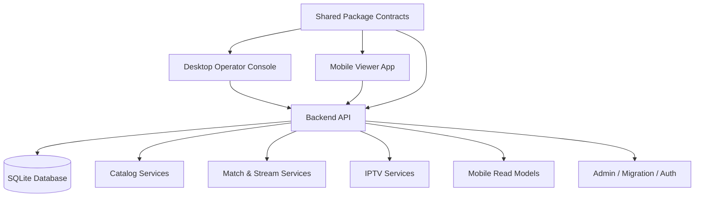
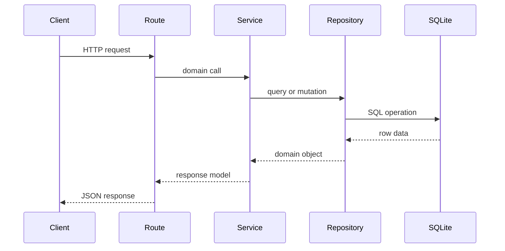
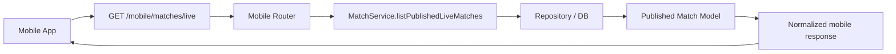
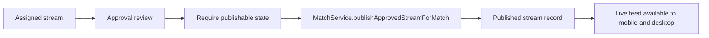
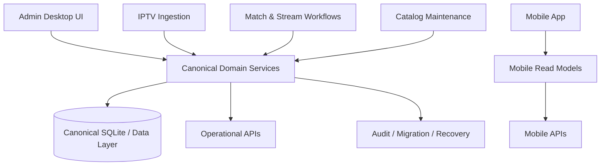

# GiTO Live Sports — Full Project Design Report and System Algorithm

## 1. Overview

GiTO Live Sports is a multi-platform sports media and operations platform built to manage catalogs, live sports data, IPTV channel operations, match publication workflows, and a mobile viewer experience. The project combines:

- a desktop operator console for administration, scheduling, IPTV, approvals, analytics, and mobile feature control
- a backend API layer built with Node.js and Express
- a mobile app built with Flutter
- a shared TypeScript package for common contracts and reusable logic
- SQLite-backed data storage with operational read models and API routes

The project’s architecture is not a single monolith in the strict sense, but it behaves like a modular platform with clear domain separations: catalog, live content, match publishing, mobile feed, and administrative operations.

This document is intended to act as a design reference for a new project designer or engineering lead who needs to understand the actual implementation and the intended system logic before extending or redesigning it.

---

## 2. Product Purpose

The platform exists to provide the following outcomes:

1. Manage sports master data such as sports, countries, competitions, teams, and club catalogs.
2. Aggregate and normalize live sports fixture and match information.
3. Ingest IPTV sources and channel metadata.
4. Assign channels to matches and stream events.
5. Approve or publish live streams for viewer consumption.
6. Deliver live match and catalog data to mobile and desktop consumers.
7. Support administrator operations, migration workflows, audit checks, and system health monitoring.

The business model is centered around live sports operations and media delivery, with emphasis on:

- operator confidence,
- strong catalog integrity,
- resilient live feed generation,
- controlled publication workflows,
- and clear separation of operational data from master catalog data.

---

## 3. High-Level Platform Architecture

### 3.1 Runtime layers

The project is structured across four technical layers:

- Presentation layer
  - Desktop: React + Electron shell
  - Mobile: Flutter app
- API layer
  - Express backend with route modules
- Domain services layer
  - Catalog, match, stream, IPTV, feature, analytics, migration services
- Persistence layer
  - SQLite database with domain tables and read-model data

### 3.2 Key runtime composition



---

## 4. System Components

### 4.1 Desktop application

The desktop app is implemented in React and handles:

- dashboard and operational summary views
- IPTV management
- match scheduling and assignment
- broadcast console
- stream approvals
- sports workspaces and master catalog screens
- mobile feature control
- analytics surfaces
- news and club/fixture management

The desktop shell is organized around navigation state, access token management, backend connectivity checks, and live match lifecycle actions.

### 4.2 Backend API

The backend is the central orchestration layer for the platform. Main route groups include:

- /auth
- /sports
- /countries
- /hosts
- /competitions
- /teams
- /clubs
- /matches
- /fixtures
- /live-matches
- /mobile
- /iptv
- /streams
- /analytics
- /system
- /api/admin
- /api/admin/migration
- /config
- /news

This means the backend is not only a CRUD API. It includes operational behavior for:

- publication readiness,
- validation rules,
- match lifecycle,
- mobile feed projections,
- feature control,
- data migration and recovery,
- operational health,
- and runtime readiness.

### 4.3 Mobile application

The mobile app is focused on:

- browsing sports and competitions
- viewing clubs and fixtures
- reading live match feed data
- personalizing follow selections
- receiving live stream data
- weathering remote config and feature flags

The app uses:

- Flutter widgets for screens
- shared_preferences for user personalization
- remote_config_service for feature toggles
- mobile_api_service for API calls
- video_player and wakelock integration for live playback

### 4.4 Shared package

The shared package provides common contracts used by the desktop app, backend, and other modules. It reduces drift between types and entities and makes the system more coherent across layers.

Typical shared concerns include:

- domain entity interfaces
- match-related types
- stream statuses and lifecycle states
- API payload contracts
- shared utility functions such as state resolution

---

## 5. Domain Model and Business Logic

### 5.1 Core catalog entities

The platform centers on a sport catalog structure with master entities:

- Sport
- Country
- Host
- Competition
- Team
- Club / National team type distinction
- Season
- Match
- Stream
- Provider
- Channel
- Operator User

These entities use a mixed catalog + operational model:

- catalog entities represent stable master data
- matches and streams are operational records tied to live sports delivery
- providers and channels are operational supply infrastructure
- approvals and publication states are workflow states, not just metadata

### 5.2 Canonical assumptions

The platform is built around the following rules:

- catalog entries are important master records and should be preserved when possible
- live operational records should survive catalog change events unless explicitly cleaned up
- match and stream state transitions must be auditable and explicit
- the mobile app is primarily a read/consumer experience of the published live data model

This is consistent with the architecture documents in the repository, especially the architecture and product specification files, which describe a catalog-first and operationally safe design.

---

## 6. Detailed Architecture by Domain

### 6.1 Catalog domain

The catalog domain includes sports management, competition management, countries, hosts, teams, clubs, and seasons.

Implementation pattern:

- route file handles HTTP entry points
- service layer delegates domain logic to repositories
- repository layer queries SQLite
- result objects are normalized and returned to the UI

Example route flow:

```text
sportsRouter.get('/')
  -> CatalogService.listSports()
  -> listSports() in repository
  -> DB query
  -> normalizeSport(request, sport)
  -> response.json({ data: ... })
```

This pattern is repeated across sports, competitions, teams, countries, clubs, and seasons.

### 6.2 Match domain

Match logic is the heartbeat of the operational platform. Matches are created, updated, published, assigned, and reviewed in multiple flows.

Core responsibilities:

- create or update match records
- resolve lifecycle state
- assign a channel to a match
- publish a stream when approved
- determine if a match is live or degraded
- expose published feed data for mobile consumption

The corresponding backend service is match-service.ts, which includes the published live feed and enhanced health analysis.

### 6.3 Stream publication domain

This domain deals with:

- channel assignment
- stream approval
- readiness states
- publication status
- health checks
- assignment rebalancing

The broadcast console and approval screens rely on this domain to build the current operational state for operators.

### 6.4 IPTV domain

The IPTV subsystem covers providers, channels, ingestion, status checks, and channel normalization. It exposes a separate operational layer that manages:

- provider onboarding
- provider health and availability
- channel sync/import from M3U/Xtream sources
- provider validation and testing
- provider status changes
- operational failures and retries

The API surfaces separate routers and services for IPTV operations, with support for provider health monitoring and synchronized ingestion.

### 6.5 Mobile read model domain

The mobile app does not directly consume the raw operational tables. It uses a mobile read-model layer built in mobile-read-model-service.ts, which transforms raw data into screen-friendly structures.

This layer provides functions for:

- mobileSports()
- mobileCompetitions()
- mobileClubs()
- mobileClubDetail()
- mobileFixture()
- mobileFixtures()
- mobileNews()
- filter validation
- stream-safe mapping for URLs and metadata

This is a critical architectural feature because the mobile app requires normalized data with consistent naming and presentation logic.

### 6.6 Security and admin domain

The backend includes:

- auth routes
- protected middleware
- admin-only routes
- migration routes
- readiness guard
- health and debug inspection endpoints

This allows the platform to separate access boundaries from business logic and provide controlled operational access.

---

## 7. Core Data Flow

### 7.1 API request flow



### 7.2 Mobile live match data flow



### 7.3 Operational publication flow



---

## 8. The Main Project Algorithms

Below are the key algorithms used by the project. These are the “behavioral recipes” that a designer must understand before changing or extending the system.

### Algorithm 1: Route-to-Service Request Normalization

Purpose: ensure all HTTP requests consistently validate, normalize, and delegate to a domain service.

```pseudo
function handleRequest(route, request, response):
    validatePathParams(request.params)
    parseQueryFilters(request.query)
    callServiceLayer(request.body, request.params)
    if service returns entity:
        normalizeUrlsAndFields(request, entity)
        return JSON response
    if service not found:
        return 404
    if validation failed:
        return 400
    if authorization failed:
        return 401/403
```

This pattern appears in sports, competitions, teams, mobile, and admin routes.

### Algorithm 2: Catalog selection and personalization algorithm

Purpose: let the mobile app remember user-followed sports, competitions, and clubs and use them to personalize browsing and news.

```pseudo
function loadUserSelections():
    sports = readSharedPrefs('gito_followed_sports')
    competitions = readSharedPrefs('gito_followed_competitions')
    teams = readSharedPrefs('gito_followed_teams')
    return normalizeStrings(sports, competitions, teams)

function matchesNews(article, preferences):
    normalizedArticleTokens = collect title + summary + body + sport + competition + team + categories
    if preferences.sports not empty and any token matches any followed sport:
        return true
    if preferences.competitions not empty and any token matches any followed competition:
        return true
    if preferences.teams not empty and any token matches any followed team:
        return true
    return false
```

This algorithm helps turn user follow selections into a personalized news and content feed.

### Algorithm 3: Mobile fixture retrieval algorithm

Purpose: return a consistent set of fixtures filtered by competition, sport, team, status, and time window.

```pseudo
function getMobileFixtures(filters):
    sportIds = unique(filters.sportIds + filters.sportId)
    competitionIds = unique(filters.competitionIds + filters.competitionId)
    teamIds = unique(filters.teamIds + filters.teamId)

    validateEachIdExistsInDatabase(sportIds, competitions, teams)

    if mode == 'following' and no filters selected:
        return []

    fixtureSets = []
    if mode == 'following':
        for each sportId in sportIds:
            add listCanonicalFixtures({ sportId })
        for each competitionId in competitionIds:
            add listCanonicalFixtures({ competitionId })
        for each teamId in teamIds:
            add listCanonicalFixtures({ teamId })
    else:
        add listCanonicalFixtures({ sportIds, competitionIds, teamIds })

    deduplicate fixtures by id
    apply pagination offset and limit
    map each fixture to mobile model
    return fixtures
```

This is the main logic behind the mobile catalog experience.

### Algorithm 4: Match publication readiness algorithm

Purpose: decide if a stream can be published for a match.

```pseudo
function canPublishMatch(matchId):
    stream = findApprovedStreamForMatch(matchId)
    if not stream:
        return false
    if stream.status not in ['assigned', 'ready', 'approved']:
        return false
    if match is not in a valid operational state:
        return false
    return true
```

The backend route uses requireMatchPublishable before allowing publish actions.

### Algorithm 5: Enhanced live feed health analysis algorithm

Purpose: classify published matches as live or degraded and explain why they are not fully healthy.

```pseudo
function getEnhancedLiveMatchFeed():
    live = listPublishedLiveMatches()
    liveIds = set(live.match.id)

    allPublished = query DB
      where match.status = 'published'
      join streams, channels, providers

    degradationReasons = {}
    totalMatches = 0

    for each match in allPublished:
        if match.id not in liveIds:
            totalMatches++
            if no stream exists:
                degradationReasons['noStream']++
            else:
                if stream.status != 'active':
                    degradationReasons['streamNotActive']++
                if published_at missing:
                    degradationReasons['notPublished']++
                if health_status == 'failed':
                    degradationReasons['healthFailed']++
                if channel status inactive:
                    degradationReasons['channelInactive']++
                if provider status inactive:
                    degradationReasons['providerInactive']++
                if provider availability offline:
                    degradationReasons['providerOffline']++

    return {
        live,
        summary: {
            liveCount: live.length,
            totalMatches: totalMatches + live.length,
            degradationReasons
        }
    }
```

This is a key algorithm for visibility, diagnostics, and operational awareness.

### Algorithm 6: IPTV provider/channel processing algorithm

Purpose: standardize ingestion and health-check behavior for IPTV suppliers.

```pseudo
function ingestProviderSource(provider):
    connect to provider endpoint
    fetch channel metadata
    parse M3U or Xtream records
    normalize channel rows
    validate URLs and provider metadata
    save or update channels
    mark provider health state
    store operational anomalies
```

This is the foundation behind the IPTV subsystem’s provider import and monitoring operations.

### Algorithm 7: Auth + protected route algorithm

Purpose: enforce identity, token validation, and route-level access control.

```pseudo
function protectedRoute(request, response, next):
    token = readAuthorizationHeader(request)
    if token missing:
        reject 401

    decoded = verifyJWT(token)
    if verification fails:
        reject 401

    request.operator = decoded.operator
    next()
```

This is used by admin and protected API routes, and acts as the security boundary around operational workflows.

### Algorithm 8: Mobile URL normalization algorithm

Purpose: convert relative upload paths to absolute URLs for frontend rendering and media access.

```pseudo
function normalizeUploadsUrl(request, url):
    if url is null:
        return url

    if url starts with '/uploads/':
        return request.protocol + '://' + request.host + url

    if url is localhost upload URL:
        replace host with current request host

    return original url
```

This keeps the UI and API contract consistent across local development and deployed environments.

---

## 9. Database and Persistence Strategy

The project uses SQLite and a broad operational schema with multiple domain tables. The database is central to stable data consistency and read models.

Main database concerns:

- catalog tables: sports, competitions, countries, teams, hosts
- operational tables: matches, streams, channels, providers
- feature tables: mobile feature flags
- audit and migration tables: operational logs and restore audit data
- read-oriented tables: canonical fixtures, notifications, and derived views

Important design principle: the platform mixes master data and operational data. That means database access must respect lifecycle states and avoid destructive changes to master catalog records unless explicitly approved.

---

## 10. Design Patterns Used in the Project

### 10.1 Route-service-repository pattern

Every major domain uses this structure:

- routes = network boundary
- services = orchestration and business logic
- repositories = persistence access

### 10.2 Read model pattern

The mobile and desktop layers rely on transformed read models rather than directly exposing raw database shapes.

### 10.3 Guard-based workflow enforcement

Some routes enforce lifecycle state checks using transition guards before a mutation is allowed.

### 10.4 Normalization and compatibility layer

The app normalizes image URLs, API payloads, and data origin so different runtime environments can behave reliably.

### 10.5 Operational status model

Many entities are not simple static rows. They carry statuses like:

- active / inactive
- published / unpublished
- assigned / approved / published
- live / ended / cancelled
- healthy / degraded / failed

These statuses drive UI behavior and backend validation.

---

## 11. Project Design Blueprint for a New Designer

### 11.1 Recommended mental model

The project should be understood as:

- a sports operations platform,
- not merely a mobile app or a frontend dashboard,
- with a strong backend service layer supporting live workflows,
- and a catalog model that must remain consistent with operational state.

### 11.2 Core design principles to preserve

1. Keep master data separate from operational lifecycle data.
2. Preserve data integrity across live workflows.
3. Keep route, service, and repository boundaries explicit.
4. Prefer normalized read models for consumer apps.
5. Manage status transitions with guard logic rather than ad hoc checks.
6. Keep admin operations auditable and reversible where possible.

### 11.3 Recommended design extensions

The new designer should consider the following as the next-step architecture priorities:

- formal domain boundaries for catalog vs operational artifacts
- a single canonical model for live match lifecycle
- clearer state machine definitions for streams, matches, providers, and channels
- standardized soft-delete policy for catalog cleanup and archival
- better data contract validation for shared types
- stronger observability and event tracing for match and stream transitions

---

## 12. Design Risks and Observed Complexity

The project has a strong working core, but it also contains architectural drift from parallel or legacy models.

Main risks:

- catalog and operational lifecycle rules can conflict if not explicitly separated
- mobile read models can diverge from backend domain truth without governance
- provider/channel ingestion logic can become inconsistent across sources
- state definitions like live, published, or approved may have overlapping semantics
- migration and audit logic must remain disciplined to avoid destructive data loss

The architecture files in the project already document a strong move toward catalog-first thinking and operational safety. Those principles should guide future redesigns.

---

## 13. Best-Guess End-State Architecture (Recommended Target State)

A future designer should aim for the following normalized architecture:



This target model preserves the current working product while reducing drift and clarifying ownership of the system’s meaningful domains.

---

## 14. Final Design Summary

GiTO Live Sports is a modern sports operations platform whose real strength lies in the combination of:

- domain-rich backend services,
- operational workflows for publishing and approvals,
- direct mobile-focused read models,
- and an operator-first desktop console.

The platform is best described as a modular live sports operations system, rather than a simple app. Its design center is the integration between:

- sports catalog data,
- real-time operational match data,
- provider/channel supply, and
- live user consumption.

A new project designer must see the system as a workflow engine connected to both master data and live media operations. The project is operational and event-driven in spirit, even though it is implemented through a classic route-service-repository architecture.

If the project is redesigned or extended, the most important design goals are:

- preserve master catalog integrity,
- isolate operational lifecycle states,
- standardize state machine behavior,
- maintain consistent API contracts,
- and keep mobile and desktop consumers aligned around canonical read models.

---

## 15. Executive Recommendation

The project is viable and functionally rich. To complete its long-term design, the next designer should treat this report as a system blueprint and anchor future work on the following core truths:

- the system is an operational live sports platform,
- the backend is the orchestration core,
- the mobile app is a consumer projection of live data,
- the desktop app is an operational command center,
- and all future work should honor catalog integrity and lifecycle safety.

This architecture can be extended cleanly if rules are clarified and enforced around lifecycle state transitions, data ownership, and read-model correctness.
